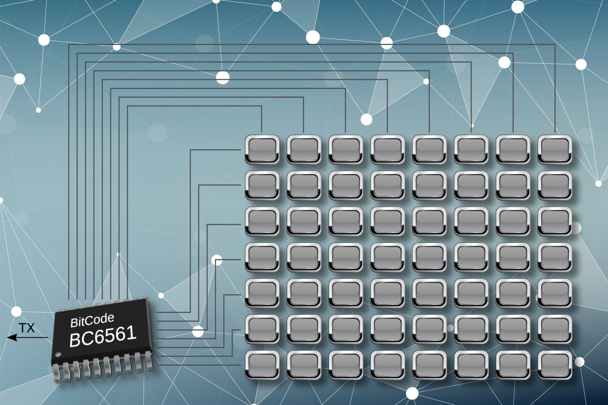

# UART Single-Wire Keyboard Driver Library

A lightweight C driver library for BitCode UART single-wire keyboard interface chips. It is designed for use with BC6xxx keyboard interface chips and BC759x 7-segment LED display driver + keyboard interface chips, including:

- **BC6301**
- **BC6561**
- **BC6088**
- **BC7595**
- **BC7591**

The driver converts raw UART keyboard events from the chip into easy-to-use key events for your application. It supports normal key press detection, optional key release detection, combination keys, long-press keys, and long-period no-key-activity detection.



---

## Features

- Standard C implementation
- Compatible with C89 and later C compilers
- Suitable for MCUs, embedded Linux, PC applications, and other C environments
- Very small memory footprint
- Simple UART event input interface
- Independent key press detection
- Optional key release detection
- User-defined combination keys
- User-defined long-press keys
- Optional callback mode for event-driven applications
- Supports long-period no-key-activity detection
- Minimal application code required

---

## How It Works

The supported chips output keyboard events through a UART single-wire interface. Each received byte represents one keyboard event.

| Value range     | Meaning                                                 |
| --------------- | ------------------------------------------------------- |
| `0x00` - `0x7F` | Key press event, the value is the key number.           |
| `0x80` - `0xFF` | Key release event. The highest bit is the release flag. |

For example:

- `0x03` means key 3 is pressed.
- `0x83` means key 3 is released, because `0x83 = 0x80 | 0x03`.

The library can also map unused key values to user-defined combination keys and long-press keys. This allows your application to process advanced keyboard events in the same way as ordinary key events.

---

## Typical Workflow

A typical application uses the library in three steps:

1. Call `update_key_status()` when a UART byte is received.
2. In the main loop, call `is_key_changed()` to check whether a new key event is available.
3. Call `get_key_value()` to read the key value and clear the new-event flag.

---

## Files

Typical files in this driver package:

```text
key_scan.c    Driver implementation
key_scan.h    Driver header file
README.md     Project description and usage guide
```

Add both `key_scan.c` and `key_scan.h` to your project.

---

## Quick Start

The complete user manual is [here(pdf)](docs/UART_Single-Wire_Keyboard_Driver_User_Manual.pdf).

```c
#include "key_scan.h"

int main(void)
{
    while (1)
    {
        /* Your main application task */
        do_something();

        /* Query keyboard status */
        if (is_key_changed())
        {
            unsigned char key_value = get_key_value();

            switch (key_value)
            {
                case 3:
                    /* Key 3 pressed */
                    do_key3_job();
                    break;

                case 24:
                    /* Key 24 pressed */
                    do_key24_job();
                    break;

                default:
                    break;
            }
        }
    }
}

void UART_ISR(void)
{
    if (RI)
    {
        unsigned char rx_data = RxData;
        update_key_status(rx_data);
    }
}
```

By default, the library reports only key press events. Key release events are ignored unless release detection is enabled.

---

## Enable Key Release Detection

```c
#include "key_scan.h"

int main(void)
{
    set_detect_mode(1);   /* 1 = detect both key press and key release */

    while (1)
    {
        if (is_key_changed())
        {
            unsigned char key_value = get_key_value();

            switch (key_value)
            {
                case 3:
                    /* Key 3 pressed */
                    do_key3_press_job();
                    break;

                case 0x83:
                    /* Key 3 released: 0x80 | 3 */
                    do_key3_release_job();
                    break;

                default:
                    break;
            }
        }
    }
}
```

---

## Long-Press Key Example

Long-press detection is based on the number of times `long_press_tick()` is called while the key remains active.

```c
#include "key_scan.h"

const unsigned char lp1[] = {5, 120};    /* Key 5 long press -> report 120 */
const unsigned char lp2[] = {20, 121};   /* Key 20 long press -> report 121 */

const unsigned char* LPDef[] = {lp1, lp2};

int main(void)
{
    set_longpress_count(60);      /* 3 seconds if long_press_tick() is called every 50 ms */
    def_longpress_key(LPDef, 2);

    while (1)
    {
        if (is_key_changed())
        {
            unsigned char key_value = get_key_value();

            switch (key_value)
            {
                case 120:
                    /* Long press of key 5 */
                    do_key5_longpress_job();
                    break;

                case 121:
                    /* Long press of key 20 */
                    do_key20_longpress_job();
                    break;

                default:
                    break;
            }
        }
    }
}

void TIMER_ISR(void)
{
    /* Call at a fixed interval, for example every 50 ms */
    long_press_tick();
}
```

---

## Combination Key Example

Combination keys are defined by arrays in this format:

```c
{key_count, defined_value, key1, key2, ...}
```

Example:

```c
#include "key_scan.h"

const unsigned char cb1[] = {2, 122, 0, 7};
/* Key 0 + key 7 -> report 122 */

const unsigned char cb2[] = {3, 123, 11, 15, 20};
/* Key 11 + key 15 + key 20 -> report 123 */

const unsigned char* CBDef[] = {cb1, cb2};
unsigned char CBMap[2];

int main(void)
{
    def_combined_key(CBDef, CBMap, 2);

    while (1)
    {
        if (is_key_changed())
        {
            unsigned char key_value = get_key_value();

            switch (key_value)
            {
                case 122:
                    /* Key 0 + key 7 combination */
                    do_combination_1_job();
                    break;

                case 123:
                    /* Key 11 + key 15 + key 20 combination */
                    do_combination_2_job();
                    break;

                default:
                    break;
            }
        }
    }
}
```

Each combination key requires one byte of RAM in the mapping array.

---

## Detect Long Periods of No Keyboard Activity

A special long-press definition using original key value `0xFF` can be used to detect long periods without keyboard activity.

```c
#include "key_scan.h"

const unsigned char lp1[] = {5, 120};
const unsigned char lp2[] = {20, 121};
const unsigned char no_key[] = {255, 255};

const unsigned char* LPDef[] = {lp1, lp2, no_key};

unsigned char no_key_time = 0;

int main(void)
{
    set_longpress_count(60);
    def_longpress_key(LPDef, 3);

    while (1)
    {
        if (is_key_changed())
        {
            unsigned char key_value = get_key_value();

            if (key_value == 255)
            {
                no_key_time++;

                if (no_key_time >= 10)
                {
                    sleep();
                }
            }
            else
            {
                no_key_time = 0;
            }
        }
    }
}
```

---

## Callback Mode

The library can call a user function automatically when a valid keyboard event is detected.

```c
#include "key_scan.h"

void keyboard_callback(unsigned char key_value)
{
    switch (key_value)
    {
        case 3:
            do_key3_job();
            break;

        default:
            break;
    }
}

int main(void)
{
    set_callback(keyboard_callback);

    while (1)
    {
        do_something();
    }
}
```

Note: If `update_key_status()` is called inside a UART interrupt, the callback is also executed inside that interrupt context. Keep the callback short to avoid increasing interrupt latency.

---

## API Reference

### `void set_detect_mode(uint8_t Mode)`

Sets whether key release events are reported.

| Mode | Description                                             |
| ---- | ------------------------------------------------------- |
| `0`  | Report key press events only. This is the default mode. |
| `1`  | Report both key press and key release events.           |

### `void set_longpress_count(uint16_t CountLimit)`

Sets the long-press threshold. The actual long-press time is:

```text
Long-press time = CountLimit x interval of long_press_tick()
```

Default value: `2000`.

### `void set_callback(void (*pCallbackFunc)(uint8_t))`

Sets a callback function for keyboard events. Pass `NULL` to disable callback mode.

### `void update_key_status(uint8_t RxData)`

Passes a received UART byte to the driver. This function is usually called from a UART receive interrupt.

### `void long_press_tick(void)`

Increments the internal long-press timer. Call this function at a constant interval, usually from a timer interrupt.

### `uint8_t is_key_changed(void)`

Returns non-zero when a new key event is available.

### `uint8_t get_key_value(void)`

Returns the latest key value and clears the new-event flag.

### `void def_combined_key(const uint8_t** pCBKeyList, uint8_t* pCBKeyMap, uint8_t CBKeyCount)`

Defines user combination keys.

- `pCBKeyList`: Array of pointers to combination key definition arrays
- `pCBKeyMap`: RAM array used for combination key state tracking
- `CBKeyCount`: Number of combination keys

Combination definition format:

```c
{count, defined_value, key1, key2, ...}
```

### `void def_longpress_key(const uint8_t** pLPKeyList, uint8_t LPKeyCount)`

Defines user long-press keys.

Long-press definition format:

```c
{original_key_value, defined_longpress_value}
```

Use `original_key_value = 0xFF` to detect long periods of no keyboard activity.

---

## Integration Notes

- Connect the chip UART output to the host MCU UART receive input according to the chip datasheet.
- Call `update_key_status()` for every received UART byte.
- Use unused key values for custom combination or long-press events.
- If release detection is disabled, release events will not be reported to the application.
- If callback mode is enabled, `is_key_changed()` will normally not report new keys because the event is consumed by the callback.
- Keep interrupt routines short, especially when using callback mode.

---

## Supported Use Cases

This library is suitable for:

- MCU keypad input interfaces
- Arduino-style embedded applications
- Industrial control panels
- IoT device input panels
- Smart home control devices
- UART keyboard modules
- 7-segment display and keyboard interface modules based on BC759x chips

---

## License

Please refer to the license file or distribution terms included with this repository.

Copyright © Beijing Bitcode Technology Co., Ltd.  
Website: https://bitcode.com.cn/en/
